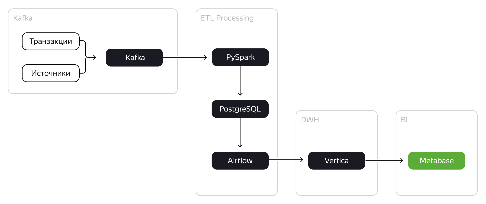

## Описание задачи
Необходимо собрать данные по транзакционной активности пользователей и настроить обновление таблицы с курсом валют. 
Цель — понять, как выглядит динамика оборота всей компании и что приводит к его изменениям. 

## Что сделать
Реализовать пайплайн обработки данных, поступающих из Kafka, с помощью Spark Streaming и полноценное хранилище
Хранилище должно быть реализовано на Vertica. 
После построения пайплайна обработки данных необходимо отдельно реализовать пайплайн формирования витрины с помощью Airflow и DAG. 
Необходимо также реализовать BI-аналитику для компании: подключиться из Metabase к Vertica и реализовать дашборд.

## Структура проекта
- py - процедура чтения данных из Kafka с помощью Spark Streaming и пакетная загрузка во временное хранилище Postgres "as is" с хранением offset.
- dags\to_stg - dag и логика инкрементальной выгрузки данных из временного хранилища Postgres, обработки (парсинга) и загрузка чанками в stg слой Vertica
- dags\cmd - dag и логика инкрементальной загрузки данных в cmd слой
- dags\cmd\sql - SQL скрипт расчета витрины и импорта в целевую таблицу
- sql - скрипты создания таблиц (DDL)
- img - скрины реализованых BI-дашбордов

## PS
dds слой не реализовывался в виду объемности проекта и отсутствия требования со стороны обучающей организации